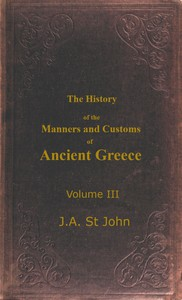

# The History of the Manners and Customs of Ancient Greece, Volume 3 (of 3) <kbd>67707</kbd>

## Authors

 - St. John, James Augustus <small>(1795 - 1875)</small>

## Subjects

 - Greece -- Social life and customs

## Download

 - https://www.gutenberg.org/ebooks/67707.txt.utf-8
 - https://www.gutenberg.org/ebooks/67707.rdf
 - https://www.gutenberg.org/ebooks/67707.html.images
 - https://www.gutenberg.org/cache/epub/67707/pg67707.cover.small.jpg
 - https://www.gutenberg.org/ebooks/67707.epub.images
 - https://www.gutenberg.org/ebooks/67707.kindle.images
 - https://www.gutenberg.org/files/67707/67707-0.zip
 - https://www.gutenberg.org/files/67707/67707-h.zip
 - https://www.gutenberg.org/files/67707/67707-0.txt

## Book Shelves

