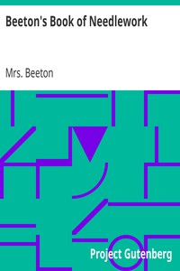

# Beeton's Book of Needlework <kbd>15147</kbd>

## Authors

 - Beeton, Mrs. (Isabella Mary) <small>(1836 - 1865)</small>

## Subjects

 - Crocheting
 - Knitting
 - Lace and lace making
 - Needlework -- Patterns

## Download

 - https://www.gutenberg.org/files/15147/15147-8.zip
 - https://www.gutenberg.org/cache/epub/15147/pg15147.cover.medium.jpg
 - https://www.gutenberg.org/files/15147/15147.zip
 - https://www.gutenberg.org/files/15147/15147-h.zip
 - https://www.gutenberg.org/files/15147/15147-8.txt
 - https://www.gutenberg.org/ebooks/15147.html.images
 - https://www.gutenberg.org/ebooks/15147.txt.utf-8
 - https://www.gutenberg.org/ebooks/15147.epub.images
 - https://www.gutenberg.org/ebooks/15147.rdf
 - https://www.gutenberg.org/ebooks/15147.kindle.images

## Book Shelves

 - Crafts
 - Technology
