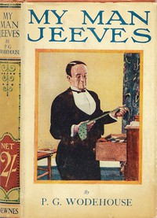

# My Man Jeeves <kbd>8164</kbd>

## Authors

 - Wodehouse, P. G. (Pelham Grenville) <small>(1881 - 1975)</small>

## Subjects

 - England -- Fiction
 - Humorous stories
 - Jeeves (Fictitious character) -- Fiction
 - Single men -- Fiction
 - Valets -- Fiction
 - Wooster, Bertie (Fictitious character) -- Fiction

## Download

 - https://www.gutenberg.org/files/8164/8164-h/8164-h.htm
 - https://www.gutenberg.org/cache/epub/8164/pg8164.cover.medium.jpg
 - https://www.gutenberg.org/ebooks/8164.txt.utf-8
 - https://www.gutenberg.org/files/8164/8164-h.zip
 - https://www.gutenberg.org/files/8164/8164-0.txt
 - https://www.gutenberg.org/ebooks/8164.rdf
 - https://www.gutenberg.org/ebooks/8164.kindle.images
 - https://www.gutenberg.org/ebooks/8164.epub.images

## Book Shelves

 - Humor
