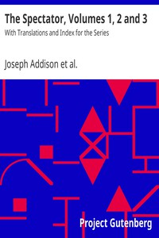

# The Spectator, Volumes 1, 2 and 3: With Translations and Index for the Series <kbd>12030</kbd>

## Authors

 - Steele, Richard, Sir <small>(1672 - 1729)</small>
 - Addison, Joseph <small>(1672 - 1719)</small>

## Subjects

 - English essays -- 18th century -- Periodicals

## Download

 - https://www.gutenberg.org/files/12030/12030-h/12030-h/SV3/transindex.html
 - https://www.gutenberg.org/cache/epub/12030/pg12030.cover.medium.jpg
 - https://www.gutenberg.org/files/12030/12030-h/12030-h.htm
 - https://www.gutenberg.org/files/12030/12030-8.zip
 - https://www.gutenberg.org/files/12030/12030-8.txt
 - https://www.gutenberg.org/files/12030/12030.txt
 - https://www.gutenberg.org/ebooks/12030.kindle.images
 - https://www.gutenberg.org/ebooks/12030.txt.utf-8
 - https://www.gutenberg.org/ebooks/12030.epub.images
 - https://www.gutenberg.org/ebooks/12030.rdf

## Book Shelves

