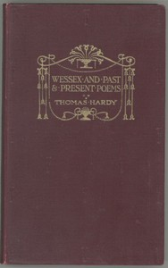

# Poems of the Past and the Present <kbd>3168</kbd>

## Authors

 - Hardy, Thomas <small>(1840 - 1928)</small>

## Subjects

 - English poetry

## Download

 - https://www.gutenberg.org/cache/epub/3168/pg3168.cover.medium.jpg
 - https://www.gutenberg.org/files/3168/3168-0.zip
 - https://www.gutenberg.org/ebooks/3168.html.images
 - https://www.gutenberg.org/ebooks/3168.rdf
 - https://www.gutenberg.org/ebooks/3168.epub.images
 - https://www.gutenberg.org/ebooks/3168.kindle.images

## Book Shelves

