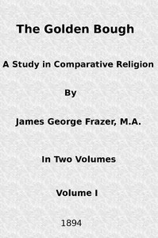

# The Golden Bough: A Study in Comparative Religion (Vol. 1 of 2) <kbd>41082</kbd>

## Authors

 - Frazer, James George <small>(1854 - 1941)</small>

## Subjects

 - Magic
 - Mythology
 - Religion
 - Superstition

## Download

 - https://www.gutenberg.org/cache/epub/41082/pg41082.cover.small.jpg
 - https://www.gutenberg.org/files/41082/41082-tei.zip
 - https://www.gutenberg.org/files/41082/41082-pdf.zip
 - https://www.gutenberg.org/files/41082/41082-h.zip
 - https://www.gutenberg.org/files/41082/41082-8.zip
 - https://www.gutenberg.org/files/41082/41082-0.txt
 - https://www.gutenberg.org/files/41082/41082.txt
 - https://www.gutenberg.org/ebooks/41082.html.images
 - https://www.gutenberg.org/ebooks/41082.kindle.images
 - https://www.gutenberg.org/files/41082/41082-tei/41082-tei.tei
 - https://www.gutenberg.org/ebooks/41082.rdf
 - https://www.gutenberg.org/files/41082/41082-pdf.pdf
 - https://www.gutenberg.org/ebooks/41082.epub.images

## Book Shelves

