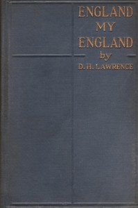

# England, My England <kbd>8914</kbd>

## Authors

 - Lawrence, D. H. (David Herbert) <small>(1885 - 1930)</small>

## Subjects

 - England -- Social life and customs -- 20th century -- Fiction
 - Short stories, English

## Download

 - https://www.gutenberg.org/cache/epub/8914/pg8914.cover.small.jpg
 - https://www.gutenberg.org/files/8914/8914-0.txt
 - https://www.gutenberg.org/files/8914/8914.txt
 - https://www.gutenberg.org/files/8914/8914-8.zip
 - https://www.gutenberg.org/files/8914/8914-h/8914-h.htm
 - https://www.gutenberg.org/files/8914/8914-8.txt
 - https://www.gutenberg.org/ebooks/8914.html.images
 - https://www.gutenberg.org/ebooks/8914.kindle.images
 - https://www.gutenberg.org/ebooks/8914.rdf
 - https://www.gutenberg.org/ebooks/8914.epub.images

## Book Shelves

 - United Kingdom
