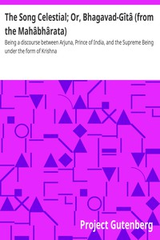

# The Song Celestial; Or, Bhagavad-Gîtâ (from the Mahâbhârata): Being a discourse between Arjuna, Prince of India, and the Supreme Being under the form of Krishna <kbd>2388</kbd>

## Authors

## Subjects

 - Epic poetry
 - Hinduism -- Sacred books
 - Sanskrit poetry -- Translations into English

## Download

 - https://www.gutenberg.org/files/2388/2388.zip
 - https://www.gutenberg.org/cache/epub/2388/pg2388.cover.small.jpg
 - https://www.gutenberg.org/files/2388/2388-h/2388-h.htm
 - https://www.gutenberg.org/ebooks/2388.html.images
 - https://www.gutenberg.org/ebooks/2388.rdf
 - https://www.gutenberg.org/ebooks/2388.epub.images
 - https://www.gutenberg.org/ebooks/2388.kindle.images
 - https://www.gutenberg.org/ebooks/2388.txt.utf-8

## Book Shelves

 - Harvard Classics
 - Hinduism
