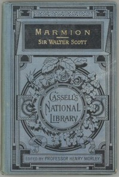

# Marmion: A Tale Of Flodden Field <kbd>4010</kbd>

## Authors

 - Scott, Walter <small>(1771 - 1832)</small>

## Subjects

 - Flodden, Battle of, England, 1513 -- Poetry

## Download

 - https://www.gutenberg.org/files/4010/4010-0.txt
 - https://www.gutenberg.org/ebooks/4010.html.images
 - https://www.gutenberg.org/cache/epub/4010/pg4010.cover.small.jpg
 - https://www.gutenberg.org/files/4010/4010-h.zip
 - https://www.gutenberg.org/ebooks/4010.epub.images
 - https://www.gutenberg.org/ebooks/4010.kindle.images
 - https://www.gutenberg.org/ebooks/4010.rdf

## Book Shelves

