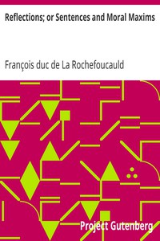

# Reflections; or Sentences and Moral Maxims <kbd>9105</kbd>

## Authors

 - La Rochefoucauld, François duc de <small>(1613 - 1680)</small>

## Subjects

 - Maxims

## Download

 - https://www.gutenberg.org/files/9105/9105.zip
 - https://www.gutenberg.org/cache/epub/9105/pg9105.cover.small.jpg
 - https://www.gutenberg.org/files/9105/9105-8.txt
 - https://www.gutenberg.org/files/9105/9105-h/9105-h.htm
 - https://www.gutenberg.org/ebooks/9105.html.images
 - https://www.gutenberg.org/files/9105/9105.txt
 - https://www.gutenberg.org/ebooks/9105.rdf
 - https://www.gutenberg.org/ebooks/9105.kindle.images
 - https://www.gutenberg.org/ebooks/9105.epub.images
 - https://www.gutenberg.org/ebooks/9105.txt.utf-8

## Book Shelves

