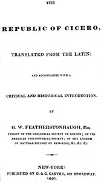

# The republic of Cicero: Translated from the Latin; and Accompanied With a Critical and Historical Introduction. <kbd>54161</kbd>

## Authors

 - Cicero, Marcus Tullius <small>(-106 - -43)</small>

## Subjects

 - Political science -- Early works to 1800
 - State, The -- Early works to 1800

## Download

 - https://www.gutenberg.org/cache/epub/54161/pg54161.cover.medium.jpg
 - https://www.gutenberg.org/files/54161/54161-0.txt
 - https://www.gutenberg.org/files/54161/54161-h/54161-h.htm
 - https://www.gutenberg.org/files/54161/54161-h.zip
 - https://www.gutenberg.org/ebooks/54161.html.images
 - https://www.gutenberg.org/ebooks/54161.rdf
 - https://www.gutenberg.org/ebooks/54161.kindle.images
 - https://www.gutenberg.org/ebooks/54161.epub.images

## Book Shelves

