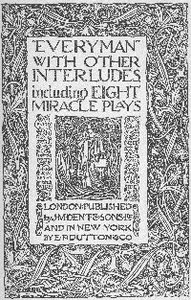

# "Everyman," with other interludes, including eight miracle plays <kbd>19481</kbd>

## Authors

## Subjects

 - Bible plays, English
 - English drama -- To 1500
 - Moralities, English
 - Mysteries and miracle-plays, English

## Download

 - https://www.gutenberg.org/files/19481/19481-0.zip
 - https://www.gutenberg.org/files/19481/19481.zip
 - https://www.gutenberg.org/files/19481/19481-8.txt
 - https://www.gutenberg.org/cache/epub/19481/pg19481.cover.medium.jpg
 - https://www.gutenberg.org/files/19481/19481.txt
 - https://www.gutenberg.org/ebooks/19481.html.images
 - https://www.gutenberg.org/files/19481/19481-h/19481-h.htm
 - https://www.gutenberg.org/ebooks/19481.epub.images
 - https://www.gutenberg.org/ebooks/19481.rdf
 - https://www.gutenberg.org/ebooks/19481.kindle.images

## Book Shelves

