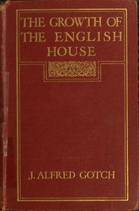

# The Growth of the English House: A short history of its architectural development from 1100 to 1800 <kbd>67574</kbd>

## Authors

 - Gotch, J. Alfred (John Alfred) <small>(1852 - 1942)</small>

## Subjects

 - Architecture -- England
 - Architecture, Domestic

## Download

 - https://www.gutenberg.org/ebooks/67574.txt.utf-8
 - https://www.gutenberg.org/files/67574/67574-h.zip
 - https://www.gutenberg.org/ebooks/67574.rdf
 - https://www.gutenberg.org/ebooks/67574.kindle.images
 - https://www.gutenberg.org/ebooks/67574.epub.images
 - https://www.gutenberg.org/ebooks/67574.html.images
 - https://www.gutenberg.org/cache/epub/67574/pg67574.cover.medium.jpg
 - https://www.gutenberg.org/files/67574/67574-0.txt
 - https://www.gutenberg.org/files/67574/67574-0.zip

## Book Shelves

