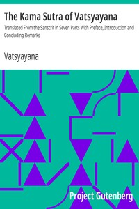

# The Kama Sutra of Vatsyayana: Translated From the Sanscrit in Seven Parts With Preface, Introduction and Concluding Remarks <kbd>27827</kbd>

## Authors

 - Vatsyayana <small>(null - null)</small>

## Subjects

 - Love
 - Sex

## Download

 - https://www.gutenberg.org/files/27827/27827-h.zip
 - https://www.gutenberg.org/cache/epub/27827/pg27827.cover.small.jpg
 - https://www.gutenberg.org/files/27827/27827-8.zip
 - https://www.gutenberg.org/files/27827/27827-8.txt
 - https://www.gutenberg.org/files/27827/27827.txt
 - https://www.gutenberg.org/ebooks/27827.html.images
 - https://www.gutenberg.org/ebooks/27827.rdf
 - https://www.gutenberg.org/ebooks/27827.kindle.images
 - https://www.gutenberg.org/ebooks/27827.epub.images
 - https://www.gutenberg.org/ebooks/27827.txt.utf-8

## Book Shelves

 - Banned Books from Anne Haight's list
 - Erotic Fiction
 - Sociology
