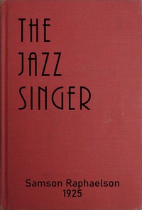

# The Jazz Singer <kbd>67583</kbd>

## Authors

 - Raphaelson, Samson <small>(1896 - 1983)</small>

## Subjects

 - Cantors (Judaism) -- Drama
 - Fathers and sons -- Drama
 - Jewish families -- Drama
 - Jewish singers -- Drama
 - New York (N.Y.) -- Drama

## Download

 - https://www.gutenberg.org/ebooks/67583.rdf
 - https://www.gutenberg.org/ebooks/67583.txt.utf-8
 - https://www.gutenberg.org/ebooks/67583.html.images
 - https://www.gutenberg.org/ebooks/67583.epub.images
 - https://www.gutenberg.org/ebooks/67583.kindle.images
 - https://www.gutenberg.org/cache/epub/67583/pg67583.cover.small.jpg
 - https://www.gutenberg.org/files/67583/67583-h.zip
 - https://www.gutenberg.org/files/67583/67583-0.txt

## Book Shelves

