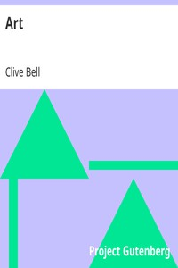

# Art <kbd>16917</kbd>

## Authors

 - Bell, Clive <small>(1881 - 1964)</small>

## Subjects

 - Aesthetics
 - Art
 - Art -- History

## Download

 - https://www.gutenberg.org/files/16917/16917-8.zip
 - https://www.gutenberg.org/files/16917/16917-h.zip
 - https://www.gutenberg.org/cache/epub/16917/pg16917.cover.medium.jpg
 - https://www.gutenberg.org/files/16917/16917.zip
 - https://www.gutenberg.org/ebooks/16917.html.images
 - https://www.gutenberg.org/files/16917/16917-h/16917-h.htm
 - https://www.gutenberg.org/ebooks/16917.txt.utf-8
 - https://www.gutenberg.org/ebooks/16917.rdf
 - https://www.gutenberg.org/ebooks/16917.epub.images
 - https://www.gutenberg.org/ebooks/16917.kindle.images

## Book Shelves

