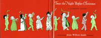

# Twas the Night before Christmas: A Visit from St. Nicholas <kbd>17135</kbd>

## Authors

 - Moore, Clement Clarke <small>(1779 - 1863)</small>

## Subjects

 - Children's poetry, American
 - Christmas -- Juvenile poetry
 - Narrative poetry
 - Santa Claus -- Juvenile poetry

## Download

 - https://www.gutenberg.org/files/17135/17135-h.zip
 - https://www.gutenberg.org/ebooks/17135.html.images
 - https://www.gutenberg.org/cache/epub/17135/pg17135.cover.small.jpg
 - https://www.gutenberg.org/files/17135/17135-0.txt
 - https://www.gutenberg.org/ebooks/17135.txt.utf-8
 - https://www.gutenberg.org/ebooks/17135.epub.images
 - https://www.gutenberg.org/ebooks/17135.rdf
 - https://www.gutenberg.org/ebooks/17135.kindle.images

## Book Shelves

 - Children's Picture Books
 - Christmas
