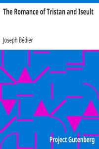

# The Romance of Tristan and Iseult <kbd>14244</kbd>

## Authors

 - Bédier, Joseph <small>(1864 - 1938)</small>

## Subjects

 - Arthurian romances -- Adaptations
 - Iseult (Legendary character) -- Romances -- Adaptations
 - Tristan (Legendary character) -- Romances -- Adaptations

## Download

 - https://www.gutenberg.org/files/14244/14244.zip
 - https://www.gutenberg.org/cache/epub/14244/pg14244.cover.small.jpg
 - https://www.gutenberg.org/files/14244/14244-h/14244-h.htm
 - https://www.gutenberg.org/files/14244/14244.txt
 - https://www.gutenberg.org/files/14244/14244-0.zip
 - https://www.gutenberg.org/ebooks/14244.html.images
 - https://www.gutenberg.org/files/14244/14244-8.txt
 - https://www.gutenberg.org/ebooks/14244.epub.images
 - https://www.gutenberg.org/ebooks/14244.kindle.images
 - https://www.gutenberg.org/ebooks/14244.rdf

## Book Shelves

