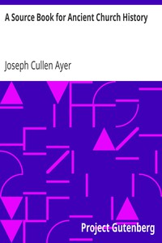

# A Source Book for Ancient Church History <kbd>24979</kbd>

## Authors

 - Ayer, Joseph Cullen <small>(1866 - 1944)</small>

## Subjects

 - Church history -- Primitive and early church, ca. 30-600 -- Sources

## Download

 - https://www.gutenberg.org/files/24979/24979.zip
 - https://www.gutenberg.org/files/24979/24979-h.zip
 - https://www.gutenberg.org/files/24979/24979.txt
 - https://www.gutenberg.org/cache/epub/24979/pg24979.cover.small.jpg
 - https://www.gutenberg.org/files/24979/24979-tei/24979-tei.tei
 - https://www.gutenberg.org/files/24979/24979-pdf.pdf
 - https://www.gutenberg.org/ebooks/24979.html.images
 - https://www.gutenberg.org/files/24979/24979-8.txt
 - https://www.gutenberg.org/ebooks/24979.rdf
 - https://www.gutenberg.org/ebooks/24979.epub.images
 - https://www.gutenberg.org/files/24979/24979-0.txt
 - https://www.gutenberg.org/ebooks/24979.kindle.images

## Book Shelves

