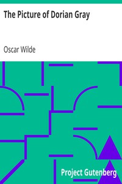

# The Picture of Dorian Gray <kbd>174</kbd>

## Authors

 - Wilde, Oscar <small>(1854 - 1900)</small>

## Subjects

 - Appearance (Philosophy) -- Fiction
 - Conduct of life -- Fiction
 - Didactic fiction
 - Great Britain -- History -- Victoria, 1837-1901 -- Fiction
 - London (England) -- History -- 1800-1950 -- Fiction
 - Paranormal fiction
 - Portraits -- Fiction
 - Supernatural -- Fiction

## Download

 - https://www.gutenberg.org/files/174/174-0.zip
 - https://www.gutenberg.org/files/174/174-h/174-h.htm
 - https://www.gutenberg.org/cache/epub/174/pg174.cover.small.jpg
 - https://www.gutenberg.org/ebooks/174.txt.utf-8
 - https://www.gutenberg.org/files/174/174-0.txt
 - https://www.gutenberg.org/ebooks/174.kindle.images
 - https://www.gutenberg.org/ebooks/174.rdf
 - https://www.gutenberg.org/ebooks/174.epub.images

## Book Shelves

 - Gothic Fiction
 - Movie Books
