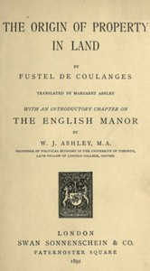

# The Origin of Property in Land: With an introductory chapter on the English manor by W. J. Ashley <kbd>67558</kbd>

## Authors

 - Fustel de Coulanges <small>(1830 - 1889)</small>

## Subjects

 - Land tenure -- Law and legislation -- History
 - Manors -- Great Britain
 - Real property -- History

## Download

 - https://www.gutenberg.org/ebooks/67558.rdf
 - https://www.gutenberg.org/ebooks/67558.txt.utf-8
 - https://www.gutenberg.org/ebooks/67558.epub.images
 - https://www.gutenberg.org/ebooks/67558.kindle.images
 - https://www.gutenberg.org/cache/epub/67558/pg67558.cover.small.jpg
 - https://www.gutenberg.org/files/67558/67558-h/67558-h.htm
 - https://www.gutenberg.org/files/67558/67558-0.txt
 - https://www.gutenberg.org/files/67558/67558-0.zip

## Book Shelves

