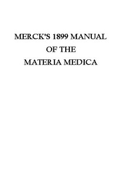

# Merck's 1899 Manual of the Materia Medica <kbd>41697</kbd>

## Authors

 - Merck & Co. <small>(null - null)</small>

## Subjects

 - Drugs -- Handbooks, manuals, etc.
 - Materia medica -- Handbooks, manuals, etc.
 - Pharmacology -- Handbooks, manuals, etc.
 - Therapeutics -- Handbooks, manuals, etc.

## Download

 - https://www.gutenberg.org/cache/epub/41697/pg41697.cover.medium.jpg
 - https://www.gutenberg.org/files/41697/41697.txt
 - https://www.gutenberg.org/files/41697/41697.zip
 - https://www.gutenberg.org/files/41697/41697-h.zip
 - https://www.gutenberg.org/ebooks/41697.html.images
 - https://www.gutenberg.org/files/41697/41697-8.txt
 - https://www.gutenberg.org/ebooks/41697.rdf
 - https://www.gutenberg.org/ebooks/41697.kindle.images
 - https://www.gutenberg.org/ebooks/41697.txt.utf-8
 - https://www.gutenberg.org/ebooks/41697.epub.images

## Book Shelves

