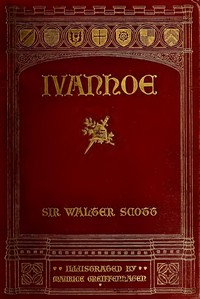

# Ivanhoe: A Romance <kbd>82</kbd>

## Authors

 - Scott, Walter <small>(1771 - 1832)</small>

## Subjects

 - Anglo-Saxons -- Fiction
 - Great Britain -- History -- Richard I, 1189-1199 -- Fiction
 - Historical fiction
 - Ivanhoe, Wilfred of, Sir (Fictitious character) -- Fiction
 - Jews -- England -- Fiction
 - Knights and knighthood -- Fiction
 - Love stories
 - Normans -- Great Britain -- Fiction
 - Triangles (Interpersonal relations) -- Fiction

## Download

 - https://www.gutenberg.org/cache/epub/82/pg82.cover.small.jpg
 - https://www.gutenberg.org/files/82/82-0.zip
 - https://www.gutenberg.org/files/82/82-0.txt
 - https://www.gutenberg.org/ebooks/82.html.images
 - https://www.gutenberg.org/files/82/82-h/82-h.htm
 - https://www.gutenberg.org/ebooks/82.kindle.images
 - https://www.gutenberg.org/ebooks/82.rdf
 - https://www.gutenberg.org/ebooks/82.epub.images

## Book Shelves

 - Best Books Ever Listings
 - Historical Fiction
