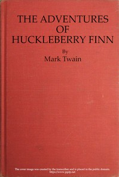

# The Adventures of Huckleberry Finn (Tom Sawyer's Comrade) <kbd>32325</kbd>

## Authors

 - Twain, Mark <small>(1835 - 1910)</small>

## Subjects

 - Adventure stories
 - Bildungsromans
 - Boys -- Fiction
 - Finn, Huckleberry (Fictitious character) -- Fiction
 - Fugitive slaves -- Fiction
 - Humorous stories
 - Male friendship -- Fiction
 - Mississippi River -- Fiction
 - Missouri -- Fiction
 - Race relations -- Fiction
 - Runaway children -- Fiction

## Download

 - https://www.gutenberg.org/cache/epub/32325/pg32325.cover.medium.jpg
 - https://www.gutenberg.org/ebooks/32325.html.images
 - https://www.gutenberg.org/files/32325/32325-0.txt
 - https://www.gutenberg.org/files/32325/32325-0.zip
 - https://www.gutenberg.org/ebooks/32325.txt.utf-8
 - https://www.gutenberg.org/ebooks/32325.epub.images
 - https://www.gutenberg.org/ebooks/32325.rdf
 - https://www.gutenberg.org/ebooks/32325.kindle.images

## Book Shelves

