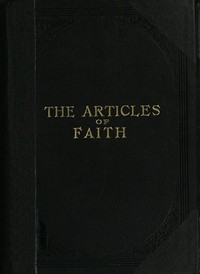

# The Articles of Faith: A Series of Lectures on the Principal Doctrines of the Church of Jesus Christ of Latter-Day Saints <kbd>42238</kbd>

## Authors

 - Talmage, James E. (James Edward) <small>(1862 - 1933)</small>

## Subjects

 - Church of Jesus Christ of Latter-day Saints -- Doctrines
 - Mormon Church -- Doctrines

## Download

 - https://www.gutenberg.org/cache/epub/42238/pg42238.cover.small.jpg
 - https://www.gutenberg.org/files/42238/42238-h/42238-h.htm
 - https://www.gutenberg.org/files/42238/42238-8.zip
 - https://www.gutenberg.org/files/42238/42238.zip
 - https://www.gutenberg.org/files/42238/42238.txt
 - https://www.gutenberg.org/ebooks/42238.html.images
 - https://www.gutenberg.org/ebooks/42238.rdf
 - https://www.gutenberg.org/ebooks/42238.kindle.images
 - https://www.gutenberg.org/ebooks/42238.txt.utf-8
 - https://www.gutenberg.org/ebooks/42238.epub.images

## Book Shelves

 - Latter Day Saints
