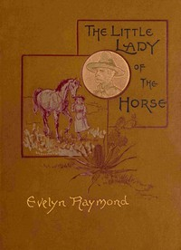

# The Little Lady of the Horse <kbd>67567</kbd>

## Authors

 - Raymond, Evelyn <small>(1843 - 1910)</small>

## Subjects

 - Horses -- Juvenile fiction
 - Ranch life -- Juvenile fiction
 - West (U.S.) -- Juvenile fiction

## Download

 - https://www.gutenberg.org/ebooks/67567.txt.utf-8
 - https://www.gutenberg.org/ebooks/67567.kindle.images
 - https://www.gutenberg.org/cache/epub/67567/pg67567.cover.small.jpg
 - https://www.gutenberg.org/ebooks/67567.rdf
 - https://www.gutenberg.org/ebooks/67567.epub.images
 - https://www.gutenberg.org/files/67567/67567-0.zip
 - https://www.gutenberg.org/files/67567/67567-0.txt
 - https://www.gutenberg.org/files/67567/67567-h/67567-h.htm

## Book Shelves

