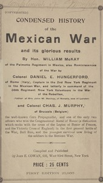

# Condensed History of the Mexican War and its Glorious Results <kbd>67722</kbd>

## Authors

 - Murphy, Charles J. <small>(null - null)</small>
 - Hungerford, Daniel E. <small>(null - null)</small>
 - McKay, William <small>(null - null)</small>

## Subjects

## Download

 - https://www.gutenberg.org/ebooks/67722.txt.utf-8
 - https://www.gutenberg.org/ebooks/67722.rdf
 - https://www.gutenberg.org/cache/epub/67722/pg67722.cover.small.jpg
 - https://www.gutenberg.org/ebooks/67722.html.images
 - https://www.gutenberg.org/ebooks/67722.epub.images
 - https://www.gutenberg.org/ebooks/67722.kindle.images
 - https://www.gutenberg.org/files/67722/67722-0.txt
 - https://www.gutenberg.org/files/67722/67722-h.zip

## Book Shelves

