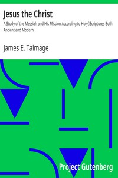

# Jesus the Christ: A Study of the Messiah and His Mission According to Holy; Scriptures Both Ancient and Modern <kbd>22542</kbd>

## Authors

 - Talmage, James E. (James Edward) <small>(1862 - 1933)</small>

## Subjects

 - Christian biography -- Palestine
 - Jesus Christ -- Biography
 - Jesus Christ -- Mormon interpretations

## Download

 - https://www.gutenberg.org/files/22542/22542-page-images.zip
 - https://www.gutenberg.org/files/22542/22542.zip
 - https://www.gutenberg.org/files/22542/22542-8.zip
 - https://www.gutenberg.org/files/22542/22542-8.txt
 - https://www.gutenberg.org/cache/epub/22542/pg22542.cover.small.jpg
 - https://www.gutenberg.org/files/22542/22542-h/22542-h.htm
 - https://www.gutenberg.org/ebooks/22542.html.images
 - https://www.gutenberg.org/ebooks/22542.kindle.images
 - https://www.gutenberg.org/ebooks/22542.epub.images
 - https://www.gutenberg.org/ebooks/22542.rdf
 - https://www.gutenberg.org/ebooks/22542.txt.utf-8

## Book Shelves

 - Christianity
 - Latter Day Saints
