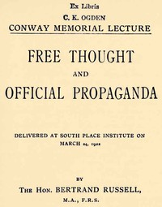

# Free Thought and Official Propaganda <kbd>44932</kbd>

## Authors

 - Russell, Bertrand <small>(1872 - 1970)</small>

## Subjects

 - Free thought
 - Liberalism
 - Propaganda

## Download

 - https://www.gutenberg.org/cache/epub/44932/pg44932.cover.medium.jpg
 - https://www.gutenberg.org/files/44932/44932-8.zip
 - https://www.gutenberg.org/files/44932/44932-8.txt
 - https://www.gutenberg.org/files/44932/44932.txt
 - https://www.gutenberg.org/ebooks/44932.html.images
 - https://www.gutenberg.org/ebooks/44932.kindle.images
 - https://www.gutenberg.org/files/44932/44932-h/44932-h.htm
 - https://www.gutenberg.org/ebooks/44932.rdf
 - https://www.gutenberg.org/ebooks/44932.epub.images
 - https://www.gutenberg.org/files/44932/44932-0.txt

## Book Shelves

