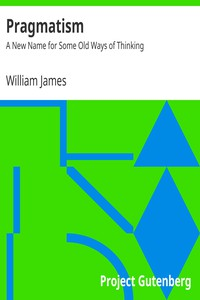

# Pragmatism: A New Name for Some Old Ways of Thinking <kbd>5116</kbd>

## Authors

 - James, William <small>(1842 - 1910)</small>

## Subjects

 - Pragmatism

## Download

 - https://www.gutenberg.org/files/5116/5116.zip
 - https://www.gutenberg.org/files/5116/5116-h.zip
 - https://www.gutenberg.org/cache/epub/5116/pg5116.cover.medium.jpg
 - https://www.gutenberg.org/ebooks/5116.html.images
 - https://www.gutenberg.org/ebooks/5116.kindle.images
 - https://www.gutenberg.org/ebooks/5116.epub.images
 - https://www.gutenberg.org/ebooks/5116.txt.utf-8
 - https://www.gutenberg.org/ebooks/5116.rdf

## Book Shelves

