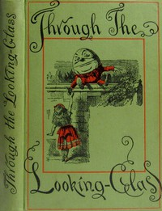

# Through the Looking-Glass <kbd>12</kbd>

## Authors

 - Carroll, Lewis <small>(1832 - 1898)</small>

## Subjects

 - Alice (Fictitious character from Carroll) -- Juvenile fiction
 - Children's stories
 - Fantasy fiction
 - Imaginary places -- Juvenile fiction

## Download

 - https://www.gutenberg.org/files/12/12-0.txt
 - https://www.gutenberg.org/cache/epub/12/pg12.cover.small.jpg
 - https://www.gutenberg.org/files/12/12-h/12-h.htm
 - https://www.gutenberg.org/ebooks/12.html.images
 - https://www.gutenberg.org/ebooks/12.kindle.images
 - https://www.gutenberg.org/ebooks/12.rdf
 - https://www.gutenberg.org/ebooks/12.epub.images

## Book Shelves

 - Best Books Ever Listings
 - Children's Literature
