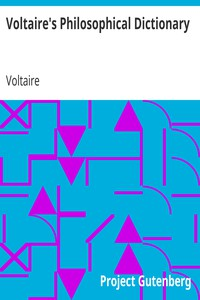

# Voltaire's Philosophical Dictionary <kbd>18569</kbd>

## Authors

 - Voltaire <small>(1694 - 1778)</small>

## Subjects

 - Philosophy -- Dictionaries

## Download

 - https://www.gutenberg.org/files/18569/18569-h.zip
 - https://www.gutenberg.org/files/18569/18569.zip
 - https://www.gutenberg.org/files/18569/18569-8.txt
 - https://www.gutenberg.org/cache/epub/18569/pg18569.cover.medium.jpg
 - https://www.gutenberg.org/ebooks/18569.html.images
 - https://www.gutenberg.org/files/18569/18569-h/18569-h.htm
 - https://www.gutenberg.org/ebooks/18569.kindle.images
 - https://www.gutenberg.org/ebooks/18569.txt.utf-8
 - https://www.gutenberg.org/ebooks/18569.epub.images
 - https://www.gutenberg.org/ebooks/18569.rdf

## Book Shelves

 - Banned Books from Anne Haight's list
