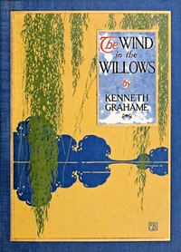

# The Wind in the Willows <kbd>27805</kbd>

## Authors

 - Grahame, Kenneth <small>(1859 - 1932)</small>

## Subjects

 - Animals -- Fiction
 - Country life -- Fiction
 - England -- Fiction
 - Fantasy fiction
 - Friendship -- Fiction
 - Humorous stories
 - Pastoral fiction
 - River life -- Fiction

## Download

 - https://www.gutenberg.org/cache/epub/27805/pg27805.cover.small.jpg
 - https://www.gutenberg.org/files/27805/27805.txt
 - https://www.gutenberg.org/files/27805/27805-8.zip
 - https://www.gutenberg.org/files/27805/27805-h.zip
 - https://www.gutenberg.org/files/27805/27805-h/27805-h.htm
 - https://www.gutenberg.org/ebooks/27805.html.images
 - https://www.gutenberg.org/ebooks/27805.txt.utf-8
 - https://www.gutenberg.org/ebooks/27805.epub.images
 - https://www.gutenberg.org/ebooks/27805.rdf
 - https://www.gutenberg.org/ebooks/27805.kindle.images

## Book Shelves

