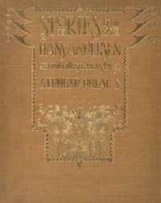

# Stories from Hans Andersen <kbd>17860</kbd>

## Authors

 - Andersen, H. C. (Hans Christian) <small>(1805 - 1875)</small>

## Subjects

 - Children's stories, Danish -- Translations into English
 - Fairy tales
 - Fairy tales -- Denmark
 - Short stories

## Download

 - https://www.gutenberg.org/files/17860/17860-h/17860-h.htm
 - https://www.gutenberg.org/cache/epub/17860/pg17860.cover.small.jpg
 - https://www.gutenberg.org/files/17860/17860.txt
 - https://www.gutenberg.org/files/17860/17860-8.txt
 - https://www.gutenberg.org/ebooks/17860.html.images
 - https://www.gutenberg.org/ebooks/17860.txt.utf-8
 - https://www.gutenberg.org/ebooks/17860.epub.images
 - https://www.gutenberg.org/ebooks/17860.rdf
 - https://www.gutenberg.org/ebooks/17860.kindle.images

## Book Shelves

 - Folklore
