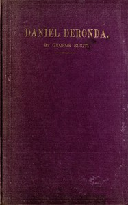

# Daniel Deronda <kbd>7469</kbd>

## Authors

 - Eliot, George <small>(1819 - 1880)</small>

## Subjects

 - Didactic fiction
 - England -- Fiction
 - Jewish fiction
 - Jews -- England -- Fiction
 - Zionists -- Fiction

## Download

 - https://www.gutenberg.org/files/7469/7469-h.zip
 - https://www.gutenberg.org/ebooks/7469.html.images
 - https://www.gutenberg.org/cache/epub/7469/pg7469.cover.medium.jpg
 - https://www.gutenberg.org/ebooks/7469.kindle.images
 - https://www.gutenberg.org/files/7469/7469-0.txt
 - https://www.gutenberg.org/ebooks/7469.rdf
 - https://www.gutenberg.org/ebooks/7469.epub.images
 - https://www.gutenberg.org/ebooks/7469.txt.utf-8

## Book Shelves

