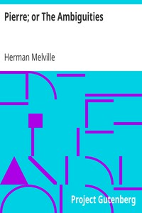

# Pierre; or The Ambiguities <kbd>34970</kbd>

## Authors

 - Melville, Herman <small>(1819 - 1891)</small>

## Subjects

 - Autobiographical fiction
 - Domestic fiction
 - Male authors -- Fiction
 - Men -- Fiction
 - Psychological fiction

## Download

 - https://www.gutenberg.org/files/34970/34970.zip
 - https://www.gutenberg.org/files/34970/34970-8.zip
 - https://www.gutenberg.org/files/34970/34970-h.zip
 - https://www.gutenberg.org/cache/epub/34970/pg34970.cover.small.jpg
 - https://www.gutenberg.org/ebooks/34970.html.images
 - https://www.gutenberg.org/files/34970/34970.txt
 - https://www.gutenberg.org/ebooks/34970.kindle.images
 - https://www.gutenberg.org/ebooks/34970.rdf
 - https://www.gutenberg.org/ebooks/34970.txt.utf-8
 - https://www.gutenberg.org/ebooks/34970.epub.images

## Book Shelves

