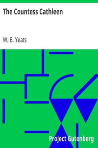

# The Countess Cathleen <kbd>5167</kbd>

## Authors

 - Yeats, W. B. (William Butler) <small>(1865 - 1939)</small>

## Subjects

 - Famines -- Ireland -- Drama
 - Nobility -- Ireland -- Drama

## Download

 - https://www.gutenberg.org/files/5167/5167.zip
 - https://www.gutenberg.org/files/5167/5167-h/5167-h.htm
 - https://www.gutenberg.org/cache/epub/5167/pg5167.cover.medium.jpg
 - https://www.gutenberg.org/ebooks/5167.html.images
 - https://www.gutenberg.org/ebooks/5167.kindle.images
 - https://www.gutenberg.org/ebooks/5167.rdf
 - https://www.gutenberg.org/ebooks/5167.txt.utf-8
 - https://www.gutenberg.org/ebooks/5167.epub.images

## Book Shelves

