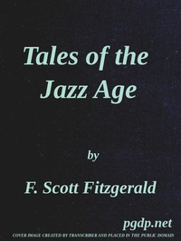

# Tales of the Jazz Age <kbd>6695</kbd>

## Authors

 - Fitzgerald, F. Scott (Francis Scott) <small>(1896 - 1940)</small>

## Subjects

 - Short stories
 - United States -- Social life and customs -- 20th century -- Fiction

## Download

 - https://www.gutenberg.org/files/6695/6695-0.zip
 - https://www.gutenberg.org/ebooks/6695.html.images
 - https://www.gutenberg.org/cache/epub/6695/pg6695.cover.medium.jpg
 - https://www.gutenberg.org/files/6695/6695-0.txt
 - https://www.gutenberg.org/ebooks/6695.kindle.images
 - https://www.gutenberg.org/ebooks/6695.rdf
 - https://www.gutenberg.org/ebooks/6695.epub.images

## Book Shelves

