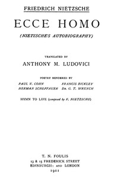

# Ecce Homo: Complete Works, Volume Seventeen <kbd>52190</kbd>

## Authors

 - Nietzsche, Friedrich Wilhelm <small>(1844 - 1900)</small>

## Subjects

 - Nietzsche, Friedrich Wilhelm, 1844-1900
 - Philosophers -- Germany -- Biography

## Download

 - https://www.gutenberg.org/cache/epub/52190/pg52190.cover.small.jpg
 - https://www.gutenberg.org/files/52190/52190-0.zip
 - https://www.gutenberg.org/files/52190/52190-h/52190-h.htm
 - https://www.gutenberg.org/files/52190/52190-0.txt
 - https://www.gutenberg.org/ebooks/52190.html.images
 - https://www.gutenberg.org/ebooks/52190.kindle.images
 - https://www.gutenberg.org/ebooks/52190.rdf
 - https://www.gutenberg.org/ebooks/52190.epub.images

## Book Shelves

