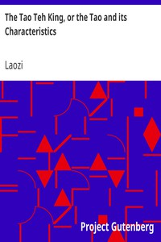

# The Tao Teh King, or the Tao and its Characteristics <kbd>216</kbd>

## Authors

 - Laozi <small>(null - null)</small>

## Subjects

 - Philosophy, Chinese
 - Taoism -- Sacred books

## Download

 - https://www.gutenberg.org/files/216/216-h.zip
 - https://www.gutenberg.org/files/216/216.zip
 - https://www.gutenberg.org/cache/epub/216/pg216.cover.small.jpg
 - https://www.gutenberg.org/files/216/216.txt
 - https://www.gutenberg.org/ebooks/216.html.images
 - https://www.gutenberg.org/ebooks/216.kindle.images
 - https://www.gutenberg.org/ebooks/216.txt.utf-8
 - https://www.gutenberg.org/ebooks/216.rdf
 - https://www.gutenberg.org/ebooks/216.epub.images

## Book Shelves

 - Paganism
