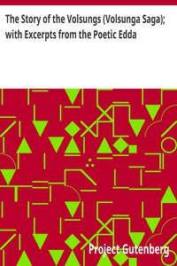

# The Story of the Volsungs (Volsunga Saga); with Excerpts from the Poetic Edda <kbd>1152</kbd>

## Authors

## Subjects

 - Eddas -- Translations into English
 - Nibelungen -- Romances
 - Sagas -- Translations into English
 - Siegfried (Legendary character) -- Romances

## Download

 - https://www.gutenberg.org/files/1152/1152-h.zip
 - https://www.gutenberg.org/files/1152/1152-h/1152-h.htm
 - https://www.gutenberg.org/cache/epub/1152/pg1152.cover.small.jpg
 - https://www.gutenberg.org/files/1152/1152.txt
 - https://www.gutenberg.org/ebooks/1152.html.images
 - https://www.gutenberg.org/ebooks/1152.rdf
 - https://www.gutenberg.org/ebooks/1152.epub.images
 - https://www.gutenberg.org/ebooks/1152.kindle.images
 - https://www.gutenberg.org/ebooks/1152.txt.utf-8

## Book Shelves

 - Fantasy
