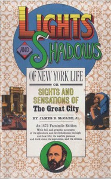

# Lights and Shadows of New York Life: or, the Sights and Sensations of the Great City <kbd>19642</kbd>

## Authors

 - McCabe, James Dabney <small>(1842 - 1883)</small>

## Subjects

 - New York (N.Y.) -- Description and travel
 - New York (N.Y.) -- Social life and customs -- 19th century

## Download

 - https://www.gutenberg.org/files/19642/19642.zip
 - https://www.gutenberg.org/files/19642/19642-h.zip
 - https://www.gutenberg.org/cache/epub/19642/pg19642.cover.small.jpg
 - https://www.gutenberg.org/files/19642/19642.txt
 - https://www.gutenberg.org/ebooks/19642.txt.utf-8
 - https://www.gutenberg.org/ebooks/19642.epub.images
 - https://www.gutenberg.org/ebooks/19642.rdf
 - https://www.gutenberg.org/ebooks/19642.kindle.images

## Book Shelves

