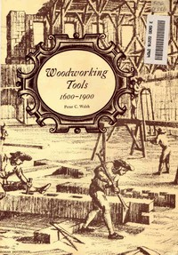

# Woodworking Tools 1600-1900 <kbd>27238</kbd>

## Authors

 - Welsh, Peter C. <small>(null - null)</small>

## Subjects

 - Woodworking tools -- History

## Download

 - https://www.gutenberg.org/files/27238/27238-8.txt
 - https://www.gutenberg.org/cache/epub/27238/pg27238.cover.medium.jpg
 - https://www.gutenberg.org/files/27238/27238-h.zip
 - https://www.gutenberg.org/files/27238/27238.txt
 - https://www.gutenberg.org/files/27238/27238-h/27238-h.htm
 - https://www.gutenberg.org/ebooks/27238.html.images
 - https://www.gutenberg.org/ebooks/27238.rdf
 - https://www.gutenberg.org/ebooks/27238.kindle.images
 - https://www.gutenberg.org/ebooks/27238.epub.images
 - https://www.gutenberg.org/ebooks/27238.txt.utf-8

## Book Shelves

 - Woodwork
