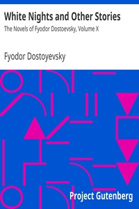

# White Nights and Other Stories: The Novels of Fyodor Dostoevsky, Volume X <kbd>36034</kbd>

## Authors

 - Dostoyevsky, Fyodor <small>(1821 - 1881)</small>

## Subjects

 - Dostoyevsky, Fyodor, 1821-1881 -- Translations into English
 - Russian fiction -- Translations into English

## Download

 - https://www.gutenberg.org/files/36034/36034.txt
 - https://www.gutenberg.org/files/36034/36034-h.zip
 - https://www.gutenberg.org/cache/epub/36034/pg36034.cover.medium.jpg
 - https://www.gutenberg.org/ebooks/36034.html.images
 - https://www.gutenberg.org/files/36034/36034-8.txt
 - https://www.gutenberg.org/ebooks/36034.rdf
 - https://www.gutenberg.org/files/36034/36034-h/36034-h.htm
 - https://www.gutenberg.org/ebooks/36034.epub.images
 - https://www.gutenberg.org/ebooks/36034.kindle.images
 - https://www.gutenberg.org/ebooks/36034.txt.utf-8

## Book Shelves

