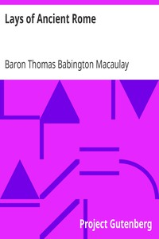

# Lays of Ancient Rome <kbd>847</kbd>

## Authors

 - Macaulay, Thomas Babington Macaulay, Baron <small>(1800 - 1859)</small>

## Subjects

 - Rome -- History -- Poetry

## Download

 - https://www.gutenberg.org/files/847/847.zip
 - https://www.gutenberg.org/cache/epub/847/pg847.cover.medium.jpg
 - https://www.gutenberg.org/files/847/847-8.zip
 - https://www.gutenberg.org/files/847/847.txt
 - https://www.gutenberg.org/files/847/847-h/847-h.htm
 - https://www.gutenberg.org/ebooks/847.html.images
 - https://www.gutenberg.org/ebooks/847.kindle.images
 - https://www.gutenberg.org/ebooks/847.txt.utf-8
 - https://www.gutenberg.org/ebooks/847.rdf
 - https://www.gutenberg.org/ebooks/847.epub.images

## Book Shelves

 - Poetry
