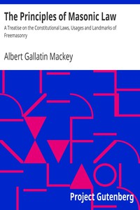

# The Principles of Masonic Law: A Treatise on the Constitutional Laws, Usages and Landmarks of Freemasonry <kbd>12186</kbd>

## Authors

 - Mackey, Albert Gallatin <small>(1807 - 1881)</small>

## Subjects

 - Freemasons -- Legal status, laws, etc.

## Download

 - https://www.gutenberg.org/files/12186/12186-h/12186-h.htm
 - https://www.gutenberg.org/files/12186/12186-h.zip
 - https://www.gutenberg.org/cache/epub/12186/pg12186.cover.small.jpg
 - https://www.gutenberg.org/files/12186/12186-8.txt
 - https://www.gutenberg.org/files/12186/12186.txt
 - https://www.gutenberg.org/ebooks/12186.html.images
 - https://www.gutenberg.org/ebooks/12186.epub.images
 - https://www.gutenberg.org/ebooks/12186.rdf
 - https://www.gutenberg.org/files/12186/12186-0.txt
 - https://www.gutenberg.org/ebooks/12186.kindle.images

## Book Shelves

