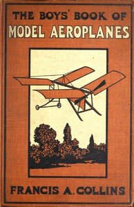

# The Boys' Book of Model Aeroplanes: How to Build and Fly Them: With the Story of the Evolution of the Flying Machine <kbd>67683</kbd>

## Authors

 - Collins, Francis A. (Francis Arnold) <small>(1873 - 1957)</small>

## Subjects

 - Aeronautics
 - Airplanes -- Models

## Download

 - https://www.gutenberg.org/ebooks/67683.html.images
 - https://www.gutenberg.org/cache/epub/67683/pg67683.cover.medium.jpg
 - https://www.gutenberg.org/files/67683/67683-h.zip
 - https://www.gutenberg.org/ebooks/67683.rdf
 - https://www.gutenberg.org/ebooks/67683.txt.utf-8
 - https://www.gutenberg.org/ebooks/67683.epub.images
 - https://www.gutenberg.org/ebooks/67683.kindle.images
 - https://www.gutenberg.org/files/67683/67683-0.txt

## Book Shelves

