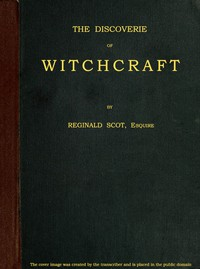

# The Discoverie of Witchcraft <kbd>60766</kbd>

## Authors

 - Scot, Reginald <small>(null - 1599)</small>

## Subjects

 - Demonology -- Early works to 1800
 - Magic -- Early works to 1800
 - Witchcraft -- Early works to 1800

## Download

 - https://www.gutenberg.org/files/60766/60766-0.txt
 - https://www.gutenberg.org/cache/epub/60766/pg60766.cover.small.jpg
 - https://www.gutenberg.org/ebooks/60766.html.images
 - https://www.gutenberg.org/files/60766/60766-h/60766-h.htm
 - https://www.gutenberg.org/ebooks/60766.epub.images
 - https://www.gutenberg.org/ebooks/60766.rdf
 - https://www.gutenberg.org/ebooks/60766.kindle.images

## Book Shelves

