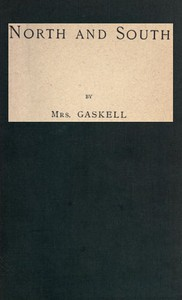

# North and South <kbd>4276</kbd>

## Authors

 - Gaskell, Elizabeth Cleghorn <small>(1810 - 1865)</small>

## Subjects

 - Bildungsromans
 - Children of clergy -- Fiction
 - Didactic fiction
 - England, Northern -- Fiction
 - Mothers and daughters -- Fiction
 - Social classes -- Fiction
 - Young women -- Fiction

## Download

 - https://www.gutenberg.org/files/4276/4276-h/4276-h.htm
 - https://www.gutenberg.org/files/4276/4276-0.txt
 - https://www.gutenberg.org/files/4276/4276-0.zip
 - https://www.gutenberg.org/cache/epub/4276/pg4276.cover.small.jpg
 - https://www.gutenberg.org/ebooks/4276.html.images
 - https://www.gutenberg.org/ebooks/4276.epub.images
 - https://www.gutenberg.org/ebooks/4276.kindle.images
 - https://www.gutenberg.org/ebooks/4276.rdf

## Book Shelves

