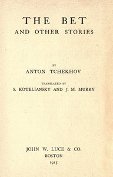

# The Bet, and other stories <kbd>55283</kbd>

## Authors

 - Chekhov, Anton Pavlovich <small>(1860 - 1904)</small>

## Subjects

 - Russian fiction -- Translations into English
 - Short stories, Russian -- Translations into English

## Download

 - https://www.gutenberg.org/files/55283/55283-8.zip
 - https://www.gutenberg.org/cache/epub/55283/pg55283.cover.small.jpg
 - https://www.gutenberg.org/files/55283/55283-h.zip
 - https://www.gutenberg.org/ebooks/55283.html.images
 - https://www.gutenberg.org/ebooks/55283.rdf
 - https://www.gutenberg.org/ebooks/55283.kindle.images
 - https://www.gutenberg.org/ebooks/55283.epub.images
 - https://www.gutenberg.org/ebooks/55283.txt.utf-8

## Book Shelves

